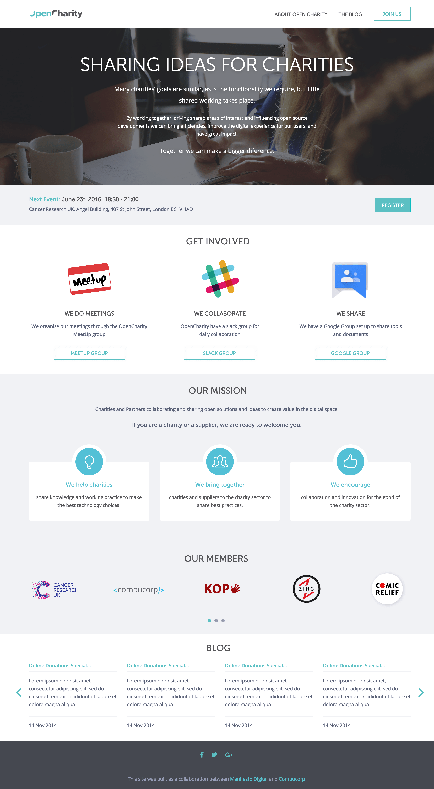
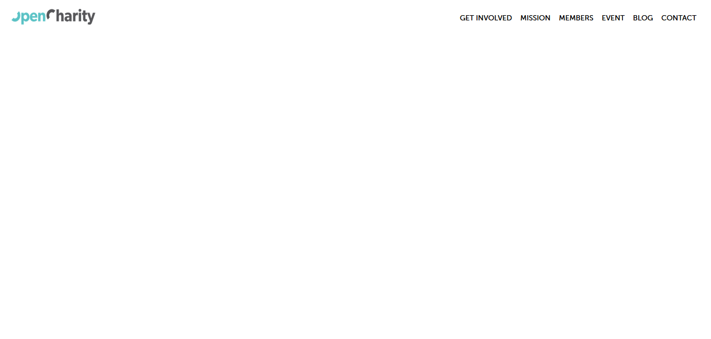
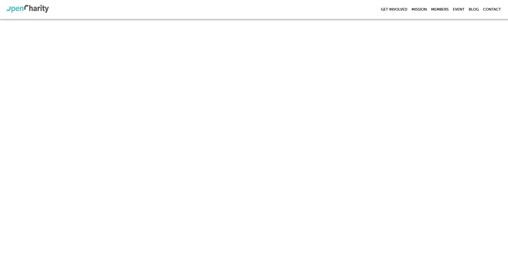
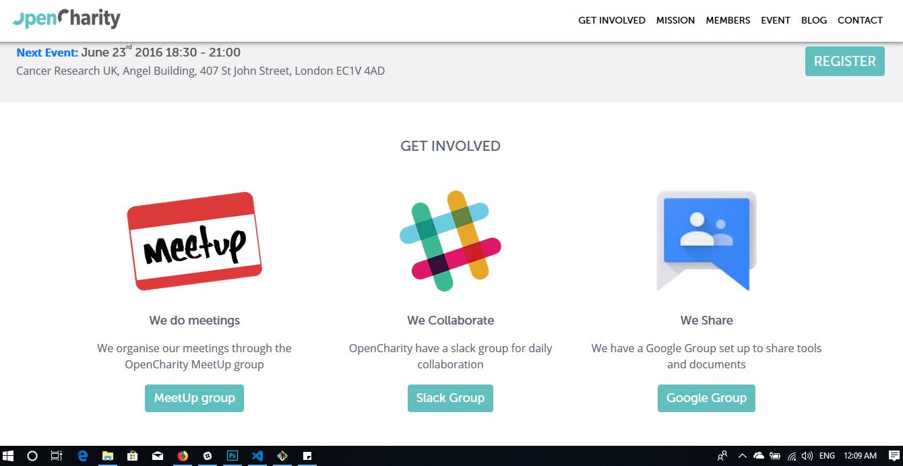

<h1 id='section7'>OpenCharity Overview</h1>

**Overview**

- Build website OpenCharity

**Details**

- Nav bar
- Slider
- Involved section
    - Flash animation and this hover that there and mission won't stop
- Member section
    - Slider
- Blog Section
- Work with us section
- Footer
- Responsive for mobile

**Bookmark**
- None

<h1 id='section8'> Prepare File</h1>

**Overview**

- Prepare file for website flow with Trello board

**Details**

- Create board Trello
- Add tasks to Trello
- Create the website folders with it's files
    - /Website/OC/assets/img || style
        - img/icons
        - sytle/font || css || js
- Create a readme.txt file
- Create an images folder and an icons folder inside of it
- Export the project's image as PNG to images folder
- Get color, font website
- Download the project fonts
- Download and save bootstrap 4
- Download and save jQuey

**Bookmark**

- Dowload Bootstrap 4 [here](http://getbootstrap.com/docs/4.1/getting-started/download/)
- Download jQuery [here](https://jquery.com/download/)
- Source Code [here](https://drive.google.com/drive/folders/1_emV94lr49gLtv01tVvHHBunGmSh7Swn)

<h1 id='section9'>Linking File and Implementing Style Sheet</h1>

**Overview**

- Linking file and making some variables for color and font

**Details**

- Create some variables color and font
- Genral reset using [meyerweb](https://meyerweb.com/eric/tools/css/reset/)
- Custom settings html, body,... tags

**Bookmark**

None

<h1 id='section10'>Navbar - part 1</h1>

**Overview**

- Create Sections

**Details**

- Section Involved, Mission, Members, Event, Blog, Contact
- Customize class `navbar-toggler` `nav-item` `nav-link`

**Bookmark**

<h1 id='section11'>Navbar - part 2</h1>

**Overview**

- Using jQuery

**Details**

- Closes responsive menu when a scroll trigger link is clicked
- Activate scrollsp to add active class to navbar items on scroll
- On scroll down .. if the offset is higher

**Bookmark**

**Result**

<h1 id='section12'>Header - part 1</h1>

**Overview**

- Header in our design we will notice that it consists of two main parts the
    - First part is the Jumbotron or the head it has an image and some text
    - The second part of that and it has a button and some text

**Details**

- Section tag have id `header` wrap all
- Using class `container-fluid` wrap children class
-  To do in the head is to make a header section
    -  Texts and talk to center all of our text inside this container
-  The second part have a button and the text.
    -  Link `Next Event` date and time
    -  Address
    -  Button Register
**Bookmark**

**Result**

<h1 id='section13'>Header - part 2</h1>

**Overview**

- Implement CSS to header

**Details**

- First part
-  `header-container` have background image
-  `footer-container` using darken() function

**Bookmark**

**Result**

<h1 id='section14'>Get Involved section</h1>

**Overview**

- We have three images with text and a button

**Details**

- Section tag have id `get-involved` wrap get involved section
- Class `container` wrap a row
- In the row we will have three four columns
- In here we have an image 
    - The first one will be this one meet up image the source
    - Image 2 is Slack Group
    - The last image is Google Group

**Bookmark**

**Result**

