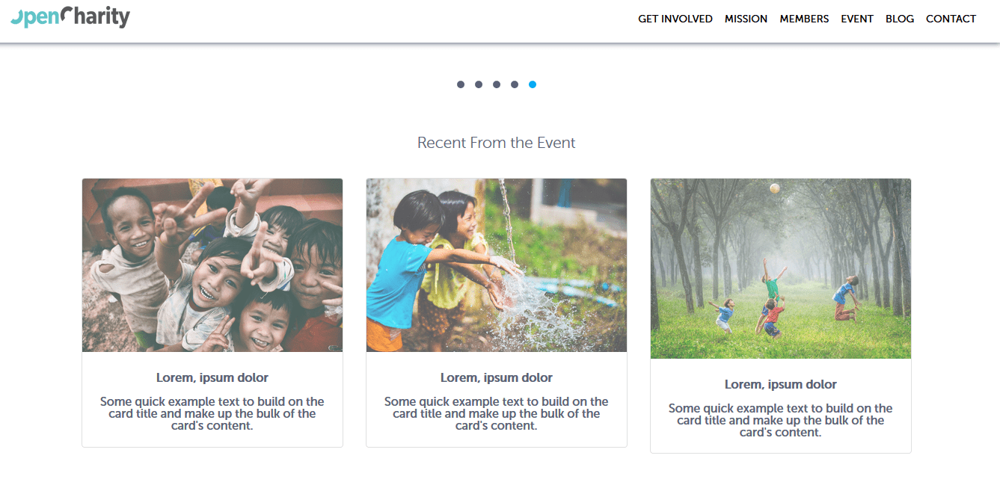

<h1 id='section7'>OpenCharity Overview</h1>

**Overview**

- Build website OpenCharity

**Details**

- Nav bar
- Slider
- Involved section
    - Flash animation and this hover that there and mission won't stop
- Member section
    - Slider
- Blog Section
- Work with us section
- Footer
- Responsive for mobile

**Bookmark**
- None

<h1 id='section8'> Prepare File</h1>

**Overview**

- Prepare file for website flow with Trello board

**Details**

- Create board Trello
- Add tasks to Trello
- Create the website folders with it's files
    - /Website/OC/assets/img || style
        - img/icons
        - sytle/font || css || js
- Create a readme.txt file
- Create an images folder and an icons folder inside of it
- Export the project's image as PNG to images folder
- Get color, font website
- Download the project fonts
- Download and save bootstrap 4
- Download and save jQuey

**Bookmark**

- Dowload Bootstrap 4 [here](http://getbootstrap.com/docs/4.1/getting-started/download/)
- Download jQuery [here](https://jquery.com/download/)
- Source Code [here](https://drive.google.com/drive/folders/1_emV94lr49gLtv01tVvHHBunGmSh7Swn)

<h1 id='section9'>Linking File and Implementing Style Sheet</h1>

**Overview**

- Linking file and making some variables for color and font

**Details**

- Create some variables color and font
- Genral reset using [meyerweb](https://meyerweb.com/eric/tools/css/reset/)
- Custom settings html, body,... tags

**Bookmark**

None

<h1 id='section10'>Navbar - part 1</h1>

**Overview**

- Create Sections

**Details**

- Section Involved, Mission, Members, Event, Blog, Contact
- Customize class `navbar-toggler` `nav-item` `nav-link`

**Bookmark**

<h1 id='section11'>Navbar - part 2</h1>

**Overview**

- Using jQuery

**Details**

- Closes responsive menu when a scroll trigger link is clicked
- Activate scrollsp to add active class to navbar items on scroll
- On scroll down .. if the offset is higher

**Bookmark**

**Result**

<h1 id='section12'>Header - part 1</h1>

**Overview**

- Header in our design we will notice that it consists of two main parts the
    - First part is the Jumbotron or the head it has an image and some text
    - The second part of that and it has a button and some text

**Details**

- Section tag have id `header` wrap all
- Using class `container-fluid` wrap children class
-  To do in the head is to make a header section
    -  Texts and talk to center all of our text inside this container
-  The second part have a button and the text.
    -  Link `Next Event` date and time
    -  Address
    -  Button Register
**Bookmark**

**Result**

<h1 id='section13'>Header - part 2</h1>

**Overview**

- Implement CSS to header

**Details**

- First part
-  `header-container` have background image
-  `footer-container` using darken() function

**Bookmark**

**Result**

<h1 id='section14'>Get Involved section</h1>

**Overview**

- We have three images with text and a button

**Details**

- Section tag have id `get-involved` wrap get involved section
- Class `container` wrap a row
- In the row we will have three four columns
- In here we have an image 
    - The first one will be this one meet up image the source
    - Image 2 is Slack Group
    - The last image is Google Group

**Bookmark**

**Result**

<h1 id="section15">Mission section</h1>

**Overview**

- We have a title and two subtitles
- And three cards so inside container

**Details**

- We will say section with id of `mission` inside this section will have div with a class `container`
- This one will be an h3 tag and this one will be h5 and this one be h4
- Under the h4 we will create a row, inside the row we have three div tag with class `col-md-4`
- Here we need a card get component bootstrap
- Image exported from file PSD with name mission1, mission2, mission3. It have direction `assets/img/`

**Bookmark**

**Result**

<h1 id='section16'>Member Section</h1>

**Overview**

- Make a slider

**Details**

- Owl Carousel 2
- Using 3 file is `owl.carousel.min.css` `owl.theme.default.min.css` and `owl.carousel.min.js`.
- Slider have 5 image with name member. It have direction `assets/img`.
- Silder action is `margin`, `smartSpeed`, `nav`, `dots`, `dotsEach`, `loop`, `autoplay`, `mouseDrag`, `touchDrag`, `responsive`.

**Bookmark**

- Owl Carousel 2 download [here](https://owlcarousel2.github.io/OwlCarousel2/)

**Result**

<h1 id='section17'>Event Section</h1>

**Overview**

- Make three event
  
**Details**

- Add to our Website some content and it's a simple section contains three bootstrap card

**Bookmark**

**Result**

<h1 id='section18'>Blog Section</h1>

**Overview**

- Make a slider
  
**Details**

- User move between slides.

**Bookmark**

**Result**

<h1 id='section19'>Contact Section and Footer</h1>

**Overview**
  
**Details**

**Bookmark**

**Result**

<h1 id="section20">Enhancements</h1>

**Overview**

- Using libary Animate.css to animate the bottom
- CSS smooth croll

**Details**

**Bookmark**

- [Animate.css](https://daneden.github.io/animate.css/)
- [Smooth Scroling](https://css-tricks.com/snippets/jquery/smooth-scrolling/)

**Result**

<h1 id="section21">Testing</h1>

**Overview**
- Test in mobile.
- Compressing images.
- Cross browser testing.
- static sites host.
- W3C markup validation server.
- Website speed test.

**Details**
- Test resposive in mobile
- Using optimizilla to optimization and lossy compression algorithms to shrink JPEG and PNG images to the minimum possible size while keeping the required level of quality.
- Cross browser is testing in chrome, firefox, IE.
- Upload your website files to static sites host bitballoon or other for running tests.
- This validator checks the markup validity of Web documents in HTML, XHTML, SMIL, MathML, etc.
- Using pingdom to speed test website.

**Bookmark**

- [Optimizilla](https://imagecompressor.com/)
- [Bitballoon](https://www.bitballoon.com/)
- [W3C markup validation server](https://validator.w3.org/)
- [Pingdom](https://tools.pingdom.com/)

<h1 id="section22">Recap</h1>

**Overview**
- Summarizes the code OpenCharity project process.

**Details**
- Export images and getting the colors by photoshop.
- The forms of our website then moving to sync our variables and customs sheet for the website.
- We have learned how we can test our code
- We can use bootstrap for its components in our website plus adding animation to our project by query or by animate.css
- And the most important thing that we have learned is how we can organize our project by applying our steps that we have written before
- And write a clean code with comments.
- The response of part of our website.
-  Website performance and run the markup and the speed test and tested it in the Old and the modern browsers.

**Bookmark**

- [OpenCharity](https://opencharity-frontend.netlify.com/)

