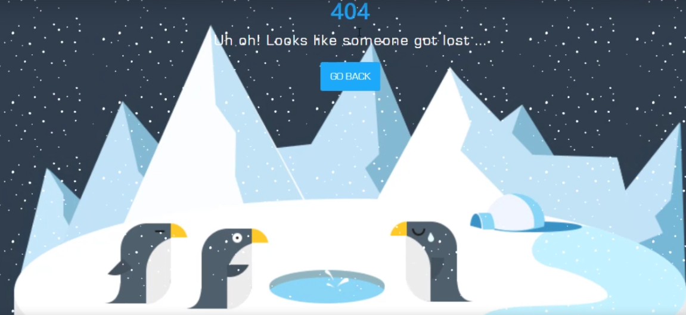

<h1 id="section23">404 Overview</h1>

**Overview**

- The main one is how you can make the snow an image
- Making the image stick at the bottom of the page no matter what device you are using
- It will always stick to the bottom of the page as we can see that design is very cool and simple as

**Details**

- It's just 404 page not found which you can use in your website as a 404.
- We have this 404 logo and text of button and image.
- Notice that the logo and the image are under the snow animation but the text and the button are above

**Bookmark**

<h1 id="section24">404 Prepare File</h1>

**Overview**

- Prepare file for 404 Project 

**Details**

- Export favicon.png, background.png and 404-penguins.png
- Download Eurostile-font
- color used:
    - grey-color: #313f4c
    - blue-color: #1ca9f9
    - white-color: #fff

**Bookmark**

