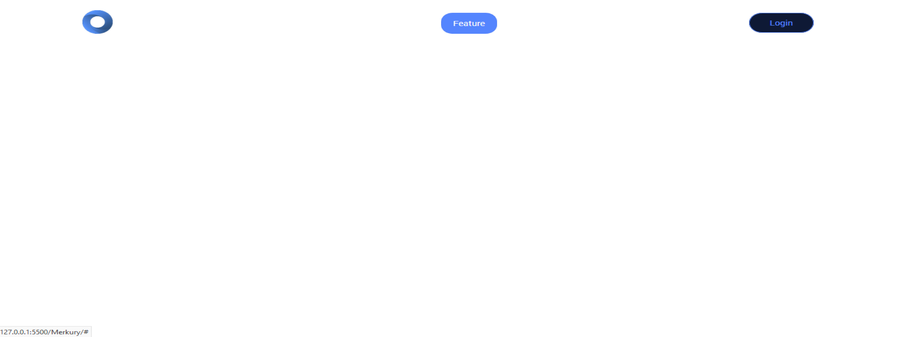

<h1 id="section27">Merkury Overview</h1>

**Overview**

- This is the project that we are going to build and it's a full introductory website of the mercury dashboard the site displays the important features and the workflow and the portfolio design of the Mercure through this project.
- We are going to learn a lot beginning with making powerful an animation by CSS and positioning elements

**Details**

- Website is the notebook
- If we scroll down and watch the Navar you can see the transition that's happening to dashboard also the background color changes from transparent to light blue color.
- We have this awesome chart on emission and background.
- The features section on the left site.
- Tilte and some text on the right site
- We can drag and drop disporting and drop here box
- Next section is Special section in this website
    - The tilte and some text the idea from this section is he dashboard image
    - These two lines appeared and reached to the image then the image appears with the set in effect
    - After that an infinite floating animation happens to the image as we see now
- Next section
    - The website have three bootstrap card but i modidied them and the card appeared.
- The Last section is the join section
    - It contains a text and a button and two separate line
- Have a simple footer with some links and social icons.

**Bookmark**

None

<h1 id="section28">Prepare Files</h1>

**Overview**

- Prepare files for Merkury code's project

**Details**
- Create the website folders with it's files
- Create a readme.txt file
- Create an images folder and an icons folder inside of it
- Get the colors of the project
- export the project's image as png
- Download and save bootstrap 4 to the project folder
- Download and save jquery, popper.min.js

**Bookmark**

- [PSD](https://drive.google.com/open?id=1TExw5ZQgVOpBKnA0UkGH5yPAVgDhrFTo)
- [Bootstrap 4](http://getbootstrap.com/docs/4.1/getting-started/introduction/)
- [jQuery](https://jquery.com/download/)
- [Popper.min.js](https://cdnjs.cloudflare.com/ajax/libs/popper.js/1.14.3/umd/popper.min.js)

<h1 id="section29">Linking Files</h1>

**Overview**

- Linking file and making some variables for color and font

**Details**

- Create some variables color and font
- Genral reset using [meyerweb](https://meyerweb.com/eric/tools/css/reset/)
- Custom settings html, body,... tags

**Bookmark**

None

<h1 id="section30">Navbar Part 1</h1>

**Overview**

- Create nav bar section

**Details**

- Nav bar includes: 
    - Feature
    - Drag-Drop
    - Template
    - Pricing
- Customize class `navbar-toggler` `nav-item` `nav-link`

**Bookmark**

None

**Result**

<h1 id="section31">Navbar Part 2</h1>

**Overview**

- Using jQuery

**Details**
- Close responsive menu when a scroll trigger link is clicked
- Activate scrollspy to add active class the navbar items on scroll
- On scroll down if the offset is higher than 50 pixels add navbar shrink class class else remove that class

**Bookmark**

None

**Result**

