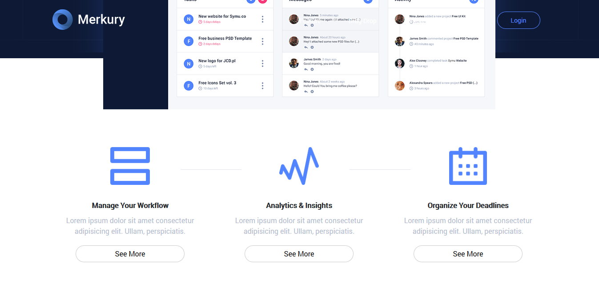
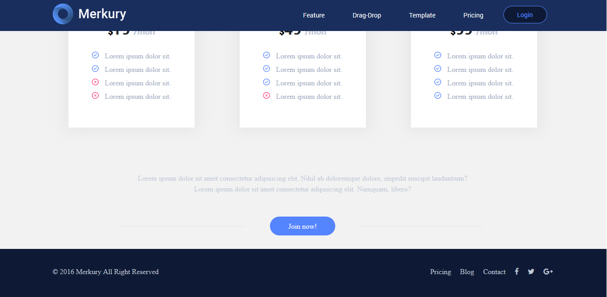

<h1 id="section27">Merkury Overview</h1>

**Overview**

- This is the project that we are going to build and it's a full introductory website of the mercury dashboard the site displays the important features and the workflow and the portfolio design of the Mercure through this project.
- We are going to learn a lot beginning with making powerful an animation by CSS and positioning elements

**Details**

- Website is the notebook
- If we scroll down and watch the Navar you can see the transition that's happening to dashboard also the background color changes from transparent to light blue color.
- We have this awesome chart on emission and background.
- The features section on the left site.
- Tilte and some text on the right site
- We can drag and drop disporting and drop here box
- Next section is Special section in this website
    - The tilte and some text the idea from this section is he dashboard image
    - These two lines appeared and reached to the image then the image appears with the set in effect
    - After that an infinite floating animation happens to the image as we see now
- Next section
    - The website have three bootstrap card but i modidied them and the card appeared.
- The Last section is the join section
    - It contains a text and a button and two separate line
- Have a simple footer with some links and social icons.

**Bookmark**

None

<h1 id="section28">Prepare Files</h1>

**Overview**

- Prepare files for Merkury code's project

**Details**
- Create the website folders with it's files
- Create a readme.txt file
- Create an images folder and an icons folder inside of it
- Get the colors of the project
- export the project's image as png
- Download and save bootstrap 4 to the project folder
- Download and save jquery, popper.min.js

**Bookmark**

- [PSD](https://drive.google.com/open?id=1TExw5ZQgVOpBKnA0UkGH5yPAVgDhrFTo)
- [Bootstrap 4](http://getbootstrap.com/docs/4.1/getting-started/introduction/)
- [jQuery](https://jquery.com/download/)
- [Popper.min.js](https://cdnjs.cloudflare.com/ajax/libs/popper.js/1.14.3/umd/popper.min.js)

<h1 id="section29">Linking Files</h1>

**Overview**

- Linking file and making some variables for color and font

**Details**

- Create some variables color and font
- Genral reset using [meyerweb](https://meyerweb.com/eric/tools/css/reset/)
- Custom settings html, body,... tags

**Bookmark**

None

<h1 id="section30">Navbar Part 1</h1>

**Overview**

- Create nav bar section

**Details**

- Nav bar includes: 
    - Feature
    - Drag-Drop
    - Template
    - Pricing
- Customize class `navbar-toggler` `nav-item` `nav-link`

**Bookmark**

None

**Result**

<h1 id="section31">Navbar Part 2</h1>

**Overview**

- Using jQuery

**Details**
- Close responsive menu when a scroll trigger link is clicked
- Activate scrollspy to add active class the navbar items on scroll
- On scroll down if the offset is higher than 50 pixels add navbar shrink class class else remove that class

**Bookmark**

None

**Result**

<h1 id="section32">Header</h1>

**Overview**

- Implement UI for Header section

**Details**
- The blue background and the grid image in one group
- Behind is the graphic image.
- Make a keyframes and animation on it
- The button `Get started`. Click on this button go to down to the services section right here.
- To make this responsive image float just like the images of class in the bootstrap

**Bookmark**

None

**Result**

<h1 id="section33">Services Section</h1>

**Overview**

- Implement UI for services section

**Details**

- The section need a row.
- Inside a row have three column and four deaths and here is a really thin separator.
- Inside a column have an image a title and some description and a bottom.

**Bookmark**

None

**Result**

<h1 id="section34">Features Section</h1>

**Overview**

- Implement UI for feature section

**Details**

-  Have two column:
    -  There is a image.
    -  There's a group of elements.

**Bookmark**

None

**Result**

<h1 id="section35">Drag and Drop Section Part 1</h1>

**Overview**

- Implement UI for Drag & Drop section
- The Drag & Drop feature allow user keep track task like Trello.com

**Details**

-  Have Three column:
    -  The first column is `In Progress` have three cards
        -  Inside a card have:
            -  Icon card
            -  Name card
            -  Dropdown include three actions
            -  Stauts: Time left
    -  Next column is `Completed` have two cards and one box
        - Inside a card have:
            -  Icon card
            -  Name card
            -  Dropdown include three actions
            -  Status: Completed
    -  The last column is `Drag & Drop`
-  Using column bootstrap. 
-  Card and dropdown in bootstrap component.

**Bookmark**

None

**Result**

<h1 id="section36">Drag and Drop Section part 2</h1>

**Overview**

- Improved UI for Drag and Drops Section.
- Integrate jQuery UI for this section

**Details**

- Improved UI for Drag and Drops Section.
- Using jQuery UI crate action drag and drop for task

**Bookmark**

- Download jQuery UI [here](https://jqueryui.com/download/)

**Result**

<h1 id="section37">Template Section</h1>

**Overview**

- Implement UI for Template section

**Details**

- The idea from the section is the dashboard template image is hidden and when users are hovers under section two lines appeared and reached the dashboard image and then the dashboard image appears setup an image.
- After that an infinite float animation happens to the dashboard image.

**Bookmark**

None

**Result**

<h1 id="section38">Pricing Section</h1>

**Overview**

- Implement UI for Pricing section

**Details**

- Section have three column about Pricing model
- Inside column have a card
- Details:
    - Name model
    - Price
    - Features

**Bookmark**

None

**Result**

<h1 id="section39">Join Section and Footer</h1>

**Overview**

- Implement UI for Join section and Footer

**Details**

- Join section have two paragraphs
- And a botton between two line.
- Footer have a copyright area text some links and some social icons.

**Bookmark**

None

**Result**

<h1 id="section40">Enhancements</h1>

**Overview**

- Check reponsive and add some media queries
- Add Smooth Scroll
- Animation with SrollReveal

**Details**

- Bug reponsive when `width <= 768px` and `width between 768px and 991px`
- Add smooth scroll help coating smooth
- ScrollReveal is a JavaScript library for easily animating elements as they enter/leave the viewport. It was designed to be robust and flexible, but hopefully you’ll be surprised below at how easy it is to pick up.

**Bookmark**
- [Smooth Scroll](https://css-tricks.com/snippets/jquery/smooth-scrolling/#article-header-id-1)
- [ScrollReveal](https://github.com/scrollreveal/scrollreveal)

**Result**

- [Go to the Merkury Project](./Chapter-4-Merkury-Website/Merkury)

<h1 id="section41">Testing</h1>

**Overview**

- Compressing images
- Cross browser testing
- Static sites host
- W3C markup validation service
- Website speed test

**Details**

- Using optimizilla to optimization and lossy compression algorithms to shrink JPEG and PNG images to the minimum possible size while keeping the required level of quality.
- Cross browser is testing in chrome, firefox, IE.
- Upload your website files to static sites host bitballoon or other for running tests.
- This validator checks the markup validity of Web documents in HTML, XHTML, SMIL, MathML, etc.
- Using pingdom to speed test website.

**Bookmark**
- [Pingdom test](https://tools.pingdom.com/#!/9UB6f/https://hopeful-booth-27591f.netlify.com/)

**Result**

- [Go to the Merkury Project](./Chapter-4-Merkury-Website/Merkury)
- [Go to Merkury site](https://merkury-frontend.netlify.com)
- 